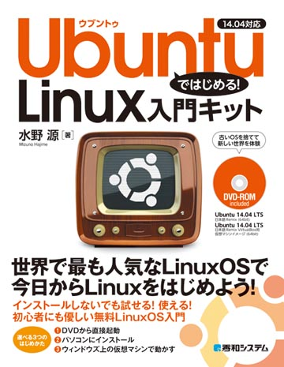
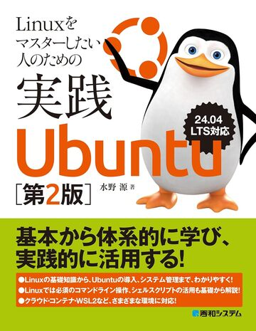

## About me

* I'm a member of [Japanese LoCo Team](https://wiki.ubuntu.com/JapaneseTeam) since 2008/07/23.
* I'm [Ubuntu Member](https://launchpad.net/~ubuntumembers) since 2011/07/22.
* I organize various events for Ubuntu in Japan.
* I join in some FOSS events and make some presentations of Ubuntu.
* I write articles about Ubuntu in some magazines and website.
* Emacs love ;)

## Launchapd

* [Launchpad Page](https://launchpad.net/~mizuno-as)

## Blog

* [Japanese](http://d.hatena.ne.jp/MIZUNO/)
* [English](http://d.hatena.ne.jp/mizuno-as/)

## What I've done

### Ubuntu Wallpaper Contest

I won a prize in Ubuntu wall paper contest several times.

#### 23.04

#### 23.10

#### 24.04

### Events

#### Off-line Meetings

The Ubuntu Off-line meeting is an event for Ubuntu users in Japan. This is a party for user communication with drinks and user's speech.

The events are held by Ubuntu Japanese LoCo Team. For past 2 years 6 events, this events has already accumurated over 400 participants. In the Off-line meeting, the attendee can install Ubuntu to their own computers from LiveCDs, USBs, SD cards or PXE-install-server, while they can listen in interesting presentations in Ubuntu.

* [Ubuntu Offline Meeting Tokyo 9.01](https://wiki.ubuntulinux.jp/Events/Offline200901Report)
    * as an Organizer
    * Presentation "Brief introduction of various way to install for Ubuntu"
    * Presentation "How to use Ubuntu without GUI in Japanese"
* [Ubuntu Offline Meeting Tokyo 9.04](https://wiki.ubuntulinux.jp/Events/Offline200904Report)
    * as an Organizer
* [Ubuntu Offline Meeting Tokyo 9.08](https://wiki.ubuntulinux.jp/Events/Offline200908Report)
    * as an Organizer
* [Ubuntu Offline "Pre" Meeting Kansai 10.08](https://wiki.ubuntulinux.jp/Events/OfflineKansai201008Report)
    * as an Organizer
* [Ubuntu Offline Meeting Kansai 10.10](https://wiki.ubuntulinux.jp/Events/OfflineKansai201010Report)
    * as an Organizer
* [Ubuntu Offline Meeting Kansai 11.03](https://wiki.ubuntulinux.jp/Events/OfflineKansai201103)
    * as an Organizer
    * Presentation "Preview Ubuntu 11.04"
* [Ubuntu Offline Meeting Tokyo 13.05](https://wiki.ubuntulinux.jp/Events/OfflineTokyo201305)
    * Presentation "Editors for multi platform"
    * [Slides](ubuntueditor.pdf)
    * [Video](http://www.ustream.tv/recorded/33293961)
* Ubuntu Offline Meeting Tokyo 14.05
* Ubuntu Offline Meeting Tokyo 15.12
    * Presentation "Tales of Server Monitoring"
    * [Slides](ubuntu-1512.pdf)
* Ubuntu Offline Meeting 18.12 - 18.10 Release Party
* Ubuntu Seminar in minoh
    * Presentation "My WSL Life - Backup of important data"
    * [Slides](ubuntu-1907.pdf)
* Ubuntu 20th anniversary offline meeting
    * Presentation "I'll show you how to win a wallpaper contest"
    * [Slides](ubuntu-2404.pdf)

#### Open Source Conference

[Open Source Conference](http://ospn.jp/) is an event of FLOSS that has been almost held in Japan every month. It gathers much people related to FLOSS in their bussiness or interests.

* [Open Source Conference 2009 Sendai](https://wiki.ubuntulinux.jp/Events/OSC2009Sendai)
    * Presentation "Brief introduction of various way to install for Ubuntu"
* [Open Source Conference 2009 Tokyo/Spring](https://wiki.ubuntulinux.jp/Events/OSC2009TokyoSpring)
    * Presentation "How to use packages"
* [Open Source Conference 2010 Kansai@Kyoto](https://wiki.ubuntulinux.jp/Events/OSC2010Kansai)
    * Presentation "How to Use Ubuntu 10.04 Server"
    * [Slides](ubuntu_10.04_server.pdf)
    * [Video1](http://www.youtube.com/watch?v=CHE6WWe7QZU)
    * [Video2](http://www.youtube.com/watch?v=uv5IIFi86Ro)
    * [Video3](http://www.youtube.com/watch?v=ldiBmz63A-I)
    * [Video4](http://www.youtube.com/watch?v=SUz4eL_Stb0)
* [Open Source Conference 2011 Kansai@Kobe](https://wiki.ubuntulinux.jp/Events/OSC2011Kobe)
    * Presentation "Introduction of Ubuntu 11.04"
    * [Slides](http://prezi.com/w3_s_huz0x6c/ubuntu-1104-preview/)
    * [Video1](http://www.youtube.com/watch?v=imZ5DFzD7ao)
    * [Video2](http://www.youtube.com/watch?v=Wr5Vmgf2EFE)
    * [Video3](http://www.youtube.com/watch?v=GLY3r4Vk7mk)
* [Open Source Conference 2011 Sendai](https://wiki.ubuntulinux.jp/Events/OSC2011Sendai)
* [Open Source Conference 2011 Hokkaido](https://wiki.ubuntulinux.jp/Events/OSC2011Hokkaido)
    * Presentation "Introduction of Ubuntu 11.04"
    * [Slides](2011Hokkaido.pdf)
 * [Open Source Conference 2011 Kansai@Kyoto](https://wiki.ubuntulinux.jp/Events/OSC2011Kyoto)
    * presentation "Introduction of Another OS"
    * discussion of "OSS Community"
* [Open Source Conference 2011 Nagoya](https://wiki.ubuntulinux.jp/Events/OSC2011Nagoya)
* [Open Source Small Conference 2011 Aizu](https://wiki.ubuntulinux.jp/Events/OSSC2011Aizu)
* [Open Source Conference 2011 Tokyo/Fall](https://wiki.ubuntulinux.jp/Events/OSC2011TokyoFall)
* [Open Source Conference 2012 Nagoya](http://www.ospn.jp/osc2012-nagoya)
    * presentation "Introductin of Ubuntu 12.04 and Ubuntu Community"
    * [Slides](2012_Nagoya.pdf)
 * [Open Source Conference 2012 Hokkaido](http://www.ospn.jp/osc2012-do)
    * presentation "Introductin of Ubuntu 12.04 and Ubuntu Community"
    * [Slides](2012_Hokkaido.pdf)
    * [Video](http://www.youtube.com/watch?v=Izk_GskVuyA)
* [Open Source Conference 2012 Sendai](http://www.ospn.jp/osc2012-sendai)
* [Open Source Conference 2012 Kansai@Kyoto](http://www.ospn.jp/osc2012-kyoto)
* [Open Source Conference 2012 Tokyo/Fall](http://www.ospn.jp/osc2012-fall)
* [Open Source Conference 2012 Aizu](http://www.ospn.jp/osc2012-aizu)
* [Open Source Conference 2013 Okinawa](http://www.ospn.jp/osc2013-okinawa)
    * presentation "Happy time of Ubuntu"
    * [Slides](osc2013okinawa.pdf)
    * [Video](https://www.youtube.com/watch?v=mNz0kWrbzCc)
* [Open Source Conference 2013 Kansai@Kyoto](http://www.ospn.jp/osc2013-kyoto)
* [Open Source Conference 2013 Hokkaido](http://www.ospn.jp/osc2013-do)
    * presentation "Happy time of Ubuntu"
    * [Slides](osc2013hokkaido.pdf)
* [Open Source Conference 2014 Okinawa](http://www.ospn.jp/osc2014-okinawa)
    * presentation "Ubuntu 14.04 LTS Overview"
    * [Slides](OSC2014Okinawa.pdf)
* [Open Source Conference 2014 Hokkaido](http://www.ospn.jp/osc2014-do)
    * presentation "Ubuntu 14.04 LTS Overview"
    * [Slides](OSC2014-do.pdf)
    * [Video](https://www.youtube.com/watch?v=O2lTFF2exGM)
* [Open Source Conference 2015 Hokkaido](http://www.ospn.jp/osc2015-do)
    * presentation "Snappy Ubuntu Overview"
    * [Slides](OSC2015-do.pdf)
* [Open Source Conference 2015 Okinawa](http://www.ospn.jp/osc2015-okinawa)
    * presentation "Snappy Ubuntu Overview"
* [Open Source Conference 2016 Hokkaido](https://www.ospn.jp/osc2016-do)
    * presentation "Ubuntu 16.04 Overview"
    * [Slides](xenial.pdf)
* [Open Source Conference 2016 Okinawa](https://www.ospn.jp/osc2016-okinawa)
    * presentation "Ubuntu 16.04 Overview"

#### Kansai Debian Meeting

Kansai Debian Meeting is meeting of Debian that has been held every month in around Kyoto,Osaka and more.

* 44th Kansai Debian Meeting (2011/02/27)
    * Presentation "Let's use pbuilder!"
    * [Slides](20110227-pbuilder.pdf)

#### Himeji IT Study

* 24th Himeji IT Study (2014/01/18)
    * Presentation "An introduction to SSH for Non-Server Engineer"
    * [Slides](An_Introduction_to_SSH_for_Non-Server_Engineer.pdf)

### Packaging

* dash-el [Debian PTS](http://packages.qa.debian.org/d/dash-el.html)
* s-el [Debian PTS](https://packages.qa.debian.org/s/s-el.html)
* silversearcher-ag [Debian PTS](http://packages.qa.debian.org/s/silversearcher-ag.html)
* silversearcher-ag-el [Debian PTS](http://packages.qa.debian.org/s/silversearcher-ag-el.html)
* twittering-mode [Debian PTS](http://packages.qa.debian.org/t/twittering-mode.htmlk)
* Emacs 23.2.1-7 merge from Debian Sid [LP: #705383](https://bugs.launchpad.net/ubuntu/+source/emacs23/+bug/705383)

#### PPA

* [gimp-painter](https://launchpad.net/~mizuno-as/+archive/gimp-painter)
    * patch added MixBrush,G-Pen tool and the color management for GIMP.
    * Why: is not the patch put in the Ubuntu (main)package?
        * The upstream project is release-suspended status. The patch is in "private" mode (Still maintenanced, but not published).
        * Of course, GPL allow branching and undertaking the yet another -painter project, but that patch (and GIMP source code) require experienced craftsmanship. So ,that is too much to handle for me.

* [mizuno-as-wallpapers](https://launchpad.net/~mizuno-as/+archive/ubuntu/wallpapers)
    * This package contains the wallpapers, photographed by mizuno-as.
    * 
    * 

* [mizuno-as Remix](https://launchpad.net/~mizuno-as/+archive/remix)
    * This package is template for ubuntu-defaults-builder.
    * Added the software commonly used. (gimp, emacs, git, bzr, ddskk, zsh, etc...)

### Translations

* [clamtk](https://launchpad.net/clamtk)
* [nano](https://translations.launchpad.net/ubuntu/natty/+source/nano)
* [sbackup](https://launchpad.net/sbackup)

### Writing

#### Books

* [Ubuntu Introduction Kit 12.04](http://www.amazon.co.jp/gp/product/4798033812)
    * 
    * 'Ubuntu Introduction Kit' is the first Ubuntu book in Japan. The first release was in 2006 (for 6.06). Author of that time is Jun Kobayashi(jkbys). and 12.04 (4th) edition wrote by me.
    * 'Ubuntu Introduction Kit' can be purchased at the bookstore (and Amazon) in Japan. Of course, Ubuntu 12.04 Japanese Remix DVD is included with this book.
* [Ubuntu Introduction Kit 14.04](http://www.amazon.co.jp/dp/4798041343)
    * 
* [そろそろ常識? マンガでわかる「Linuxコマンド」](https://www.amazon.co.jp/dp/4863543468)
    * 
    * A book that explains Linux commands in "manga and chat style" for beginners.
* [いちばんやさしい新しいサーバーの教本](https://www.amazon.co.jp/gp/product/B09RWHZL7L)
    * 
* [Linuxをマスターしたい人のための実践Ubuntu](https://www.amazon.co.jp/dp/479806825X)
    * 
* [Linuxをマスターしたい人のための実践Ubuntu 第2版](https://www.amazon.co.jp/dp/4798073245)
    * 
* [仮想化環境の構築から運用まで Proxmox VE実践ガイド](https://www.amazon.co.jp/dp/4296207318)
    * 

#### Magazines

##### Ubuntu Magazine Japan

This is a first magazine specialised for Ubuntu in Japan. It is widely sold at book stores throughout Japan and published about 4 times a year.

* [Vol.1](http://www.amazon.co.jp/gp/product/4048679961/)
* [Vol.2](http://www.amazon.co.jp/gp/product/404868258X/)
* [Vol.3](http://www.amazon.co.jp/gp/product/4048684485/)
* [Vol.4](http://www.amazon.co.jp/gp/product/4048686399/)
* [Vol.5](http://www.amazon.co.jp/gp/product/4048689789/)
* [Vol.6](http://www.amazon.co.jp/dp/4048862359/)
* [Vol.7](http://www.amazon.co.jp/dp/4048865358/)
* [Vol.8](http://www.amazon.co.jp/dp/4048866893/)
* [Vol.9](http://www.amazon.co.jp/dp/4048910671/)
* [Vol.10](http://www.amazon.co.jp/dp/B00A6BPIA0/)
* [2013 Summer](http://www.amazon.co.jp/dp/404891815X)

##### Software Design

Software Design is computer information magazine of Japan. The topic is UNIX, a programming, a network, and Cloud, etc.

* Special feature article
    * [May 2009 "The charm of Ubuntu"](http://gihyo.jp/magazine/SD/archive/2009/200905)
    * [June 2010 "Complete explanation of Ubuntu 10.04"](http://gihyo.jp/magazine/SD/archive/2010/201006)
    * [June 2013 "How to use Unix command"](http://gihyo.jp/magazine/SD/archive/2013/201306)
    * [November 2013 "My best friend Emacs"](http://gihyo.jp/magazine/SD/archive/2013/201311)
    * [May 2015 "Basic lesson of Text processing"](http://gihyo.jp/magazine/SD/archive/2015/201505)
    * [Vim & Emacs expart mook](http://gihyo.jp/book/2016/978-4-7741-8007-6)
    * [May 2016 "Ubuntu 16.04 Overview"](http://gihyo.jp/magazine/SD/archive/2016/201605)
    * [May 2018 "Ubuntu 18.04 Overview"](http://gihyo.jp/magazine/SD/archive/2018/201805)
    * [July 2018 "UNIX Command 20"](http://gihyo.jp/magazine/SD/archive/2018/201807)
    * [September 2020 "UNIX command"](https://gihyo.jp/magazine/SD/archive/2020/202009)
    * [November 2023 "Docker Image"](https://gihyo.jp/magazine/SD/archive/2023/202311)
    * [April 2024 "Linux introduction"](https://gihyo.jp/magazine/SD/archive/2024/202404)
    * [May 2024 "Ubuntu 24.04 LTS"](https://gihyo.jp/magazine/SD/archive/2024/202405)
* As the series "Ubuntu Monthly Report"
    * [July 2010 "Construct thin client with LTSP-5 on Ubuntu"](http://gihyo.jp/magazine/SD/archive/2010/201007)
    * [August 2010 "How to use UCK"](http://gihyo.jp/magazine/SD/archive/2010/201008)
    * [June 2011 "The build packages it with pbuilder-dist"](http://gihyo.jp/magazine/SD/archive/2011/201106)
    * [August 2011 "Private Cloud on Ubuntu with OpenStack"](http://gihyo.jp/magazine/SD/archive/2011/201108)
    * [September 2011 "KVM Virtual Machine Server with libvirt"](http://gihyo.jp/magazine/SD/archive/2011/201109)
    * [November 2011 "GPG Key Sign with caff"](http://gihyo.jp/magazine/SD/archive/2011/201111)
    * [August 2012 "Package import from Debian"](http://gihyo.jp/magazine/SD/archive/2012/201208)
    * [January 2017 "How to securely manage passwords with GPG and Git"](http://gihyo.jp/magazine/SD/archive/2017/201701)
    * [December 2017 "Use the tiled Window Manager bspwm"](http://gihyo.jp/magazine/SD/archive/2017/201712)
    * [April 2019 "install kubernetes"](https://gihyo.jp/magazine/SD/archive/2019/201904)

##### Linux 100%

This is Linux introductory magazine for the beginner (chiefly Windows guy).

* [Vol.13](http://www.amazon.co.jp/dp/4863911106)
* [Vol.14](http://www.amazon.co.jp/dp/4863911386)
* [Vol.15](http://www.amazon.co.jp/dp/4863911734)
* [Vol.16](http://www.amazon.co.jp/dp/4863912986)
* [Maruwakari Linux](http://www.amazon.co.jp/dp/4863913990)
* [Vol.17](http://www.amazon.co.jp/dp/4863914970)
* [Vol.18](http://www.amazon.co.jp/dp/4863915411)
* [Linux complete bible](http://www.amazon.co.jp/dp/4863917805)

##### Nikkei Linux

 * [May 2014](http://www.amazon.co.jp/dp/B00JOCDSBS)
 * [June 2014](http://www.amazon.co.jp/dp/B00JQJHZ2C)
 * [July 2014](http://www.amazon.co.jp/dp/B00KH7T1XI)
 * [August 2014](http://www.amazon.co.jp/dp/B00L4HSJYM)
 * [September 2014](http://www.amazon.co.jp/dp/B00M4KGVE8)
 * [October 2014](http://www.amazon.co.jp/dp/B00MW63IN6)
 * [November 2014](http://www.amazon.co.jp/dp/B00NO28ZF8)
 * [December 2014](http://www.amazon.co.jp/dp/B00OYSPFK4)
 * [January 2015](http://www.amazon.co.jp/dp/B00PWPLEWQ)
 * [February 2015](http://www.amazon.co.jp/dp/B00R1MLZS6)
 * [March 2015](http://www.amazon.co.jp/dp/B00S5TM46Q)
 * [April 2015](http://www.amazon.co.jp/dp/B00T3C6G1S)
 * [May 2015](http://www.amazon.co.jp/dp/B00TIVBDR6)
 * [June 2015](http://www.amazon.co.jp/dp/B00UJXLDP4)
 * [July 2015](http://www.amazon.co.jp/dp/B00ZEL935S)
 * [August 2015](http://www.amazon.co.jp/dp/B00ZD9E15S)
 * [September 2015](http://www.amazon.co.jp/dp/B010TMI4YM)
 * [October 2015](https://www.amazon.co.jp/dp/B0157UYWD8)
 * [November 2015](http://www.amazon.co.jp/dp/B014TC0TZ0)
 * [December 2015](http://www.amazon.co.jp/dp/B016030XHA)
 * [January 2016](http://www.amazon.co.jp/dp/B017A61V4U)
 * [February 2016](http://www.amazon.co.jp/dp/B018R7G4XY)
 * [March 2016](http://www.amazon.co.jp/dp/B019T9FN7W)
 * [April 2016](https://www.amazon.co.jp/dp/B01CQNG50W)
 * [May 2016](http://www.amazon.co.jp/dp/B01DDZ0KB2)
 * [June 2016](http://www.amazon.co.jp/dp/B01DE0B254)
 * [July 2016](https://www.amazon.co.jp/dp/B01GTC5WFA)
 * [August 2016](https://www.amazon.co.jp/dp/B01I8Z7R4K)
 * [September 2016](https://www.amazon.co.jp/dp/B01K1934XE)
 * [October 2016](https://www.amazon.co.jp/dp/B01LW0241D)
 * [November 2016](https://www.amazon.co.jp/dp/B01MA2X03B)
 * [December 2016](https://www.amazon.co.jp/dp/B01N3TQZ7T)
 * [January 2017](https://www.amazon.co.jp/dp/B01MQU1H76)
 * [February 2017](https://www.amazon.co.jp/dp/B01MY72PAK)
 * [March 2017](https://www.amazon.co.jp/dp/B06WLGMNGH)
 * [April 2017](https://www.amazon.co.jp/dp/B06XH1ZDBT)
 * [May 2017](https://www.amazon.co.jp/dp/B06Y5RLT7T)
 * [June 2017](https://www.amazon.co.jp/dp/B07143JXXF)
 * [July 2017](https://www.amazon.co.jp/dp/B07218VCDZ)
 * [August 2017](https://www.amazon.co.jp/dp/B073TVJZSN)
 * [September 2017](https://www.amazon.co.jp/dp/B074NZ384C)
 * [November 2017](https://www.amazon.co.jp/dp/B075ZC8D4R)
 * [January 2018](https://www.amazon.co.jp/dp/B07731FT58)
 * [March 2018](https://www.amazon.co.jp/dp/B07926TFXB)
 * [May 2018](https://www.amazon.co.jp/dp/B07B64Z7GH)
 * [July 2018](https://www.amazon.co.jp/dp/B07CXC36NR)
 * [September 2018](https://www.amazon.co.jp/dp/B07F7R8R4W)
 * [November 2018](https://www.amazon.co.jp/dp/B07HNF4BYK)
 * [January 2019](https://www.amazon.co.jp/dp/B07K22FJ3H)
 * [March 2019](https://www.amazon.co.jp/dp/B07MHQ2W2X)
 * [May 2019](https://www.amazon.co.jp/dp/B07QHHSPHW)
 * [July 2019](https://www.amazon.co.jp/dp/B07SSGTP7W)
 * [September 2019](https://www.amazon.co.jp/dp/B07W4F83ZY)
 * [November 2019](https://www.amazon.co.jp/dp/B07YS3JCQQ)
 * [January 2020](https://www.amazon.co.jp/dp/B082DSHXVM)
 * [March 2020](https://www.amazon.co.jp/dp/B084JDY2V5)
 * [May 2020](https://www.amazon.co.jp/dp/B086V5TJH2)
 * [July 2020](https://www.amazon.co.jp/dp/B089Q5MW34)
 * [September 2020](https://www.amazon.co.jp/dp/B08FBQXS97)
 * [November 2020](https://www.amazon.co.jp/dp/B08KSMFQMK)
 * [January 2021](https://www.amazon.co.jp/dp/B08PTMGSD6)
 * [March 2021](https://www.amazon.co.jp/dp/B08W1F8RZN)
 * [May 2021](https://www.amazon.co.jp/dp/B091YDMPBN)
 * [July 2021](https://www.amazon.co.jp/dp/B096RT3GWH)
 * [September 2021](https://www.amazon.co.jp/dp/B09BTT3RJN)
 * [November 2021](https://www.amazon.co.jp/dp/B09HTB5QXV)
 * [January 2022](https://www.amazon.co.jp/dp/B09N3B7YWM)
 * [March 2022](https://www.amazon.co.jp/dp/B09RSVNCVP)
 * [May 2022](https://www.amazon.co.jp/dp/B09X99PZN5)
 * [July 2022](https://www.amazon.co.jp/dp/B0B38KK4KY)
 * [September 2022](https://www.amazon.co.jp/dp/B0B8MW84H4)
 * [November 2022](https://www.amazon.co.jp/gp/product/B0BHCG58ZZ)
 * [January 2023](https://www.amazon.co.jp/gp/product/B0BP6RPDWH)
 * [March 2023](https://www.amazon.co.jp/dp/B0BTY7KZVN)
 * [May 2023](https://www.amazon.co.jp/dp/B0C1J8QBSB)
 * [July 2023](https://www.amazon.co.jp/dp/B0C77TZ81G)
 * [September 2023](https://www.amazon.co.jp/dp/B0CDPQ69RR)
 * [November 2023](https://www.amazon.co.jp/dp/B0CKF1CFK2)
 * [January2024](https://www.amazon.co.jp/dp/B0CPLPXZFG)

##### NetWalker Guide Book

 * [NetWalker Guide Book](http://www.amazon.co.jp/dp/4048681648)

##### Weekly ASCII

This is most popular weekly PC magazine in Japan.

* [Weekly ASCII Special edition 2013/08/09](http://www.amazon.co.jp/gp/product/B00DG8FT1I)

#### Website

##### Ubuntu Biyori

* [003 Play "ELDENRING" for Windows on Steam](https://pc.watch.impress.co.jp/docs/column/ubuntu/1409524.html)
* [012 Streamline your Ubuntu CLI operations with Shortcut and Byobu](https://pc.watch.impress.co.jp/docs/column/ubuntu/1444004.html)
* [017 Better manage digital photos with Ubuntu](https://pc.watch.impress.co.jp/docs/column/ubuntu/1463282.html)
* [021 Are the virus measures necessary? Why is root invalid? Basics of the security in Ubuntu](https://pc.watch.impress.co.jp/docs/column/ubuntu/1479414.html)
* [022 Let's enhance security of Ubuntu by the strong password and two factor authentication](https://pc.watch.impress.co.jp/docs/column/ubuntu/1483060.html)
* [035 Rasiperry Pi Zero 2W](https://pc.watch.impress.co.jp/docs/column/ubuntu/1531425.html)
* [036 SSH](https://pc.watch.impress.co.jp/docs/column/ubuntu/1536955.html)
* [039 Text Editor](https://pc.watch.impress.co.jp/docs/column/ubuntu/1547201.html)
* [040 CLI Editor](https://pc.watch.impress.co.jp/docs/column/ubuntu/1551316.html)
* [044 Palworld](https://pc.watch.impress.co.jp/docs/column/ubuntu/1563920.html)
* [048 Cockpit](https://pc.watch.impress.co.jp/docs/column/ubuntu/1576889.html)
* [053 Free Game for Ubuntu](https://pc.watch.impress.co.jp/docs/column/ubuntu/1596353.html)
* [055 WireGuard VPN](https://pc.watch.impress.co.jp/docs/column/ubuntu/1606110.html)
* [065 Sway Window Manager](https://pc.watch.impress.co.jp/docs/column/ubuntu/1645237.html)
* [072 Let's get started with Ubuntu again in WSL](https://pc.watch.impress.co.jp/docs/column/ubuntu/2004458.html)
* [074 Ubuntu on TENKU LUNA](https://pc.watch.impress.co.jp/docs/column/ubuntu/2018705.html)
* [081 Running Windows 11 on a VM in Ubuntu](https://pc.watch.impress.co.jp/docs/column/ubuntu/2061369.html)
* [082 MicroCloud](https://pc.watch.impress.co.jp/docs/column/ubuntu/2064787.html)
* [084 Heroic Game Launcher](https://pc.watch.impress.co.jp/docs/column/ubuntu/2076427.html)

##### Ittoke! Ubuntu Dojo

This is a series to talk by Ubuntu Japanese LoCo members for Ubuntu topics.

* [Vol. 61](http://ascii.jp/elem/000/000/734/734030/)
* [Vol. 60](http://ascii.jp/elem/000/000/725/725528/)
* [Vol. 59](http://ascii.jp/elem/000/000/716/716204/)
* [Vol. 58](http://ascii.jp/elem/000/000/708/708652/)

##### Ubuntu Weekly Recipe

This is a weekly series to introduce recipes for maximizing Ubuntu life quality. Ubuntu Japanese LoCo members take charge of the series respectively.

* [How to use PPA (2008/11/26)](http://gihyo.jp/admin/serial/01/ubuntu-recipe/0046)
* [Network install and apt-mirror (2008/12/03)](http://gihyo.jp/admin/serial/01/ubuntu-recipe/0047)
* [How to use SSH (2009/01/21)](http://gihyo.jp/admin/serial/01/ubuntu-recipe/0053)
* [file version control (2009/02/25)](http://gihyo.jp/admin/serial/01/ubuntu-recipe/0058)
* [How to use of Japanese Team member's Ubuntu (2009/05/03)](http://gihyo.jp/admin/serial/01/ubuntu-recipe/0068)
* [Beginning Emacs! (2009/06/03)](http://gihyo.jp/admin/serial/01/ubuntu-recipe/0073)
* [How to use digital SLR camera with Ubuntu (2009/06/10)](http://gihyo.jp/admin/serial/01/ubuntu-recipe/0074)
* [Ubuntu on DELL Vostro 1720(1) (2009/07/29)](http://gihyo.jp/admin/serial/01/ubuntu-recipe/0081)
* [Ubuntu on DELL Vostro 1720(2) (2009/08/05)](http://gihyo.jp/admin/serial/01/ubuntu-recipe/0082)
* [let's enjoy game on Ubuntu (2010/03/31)](http://gihyo.jp/admin/serial/01/ubuntu-recipe/0115)
* [Beginning programing by Emacs and Ubuntu(1) (2010/04/07)](http://gihyo.jp/admin/serial/01/ubuntu-recipe/0116)
* [Beginning programing by Emacs and Ubuntu(2) (2010/04/14)](http://gihyo.jp/admin/serial/01/ubuntu-recipe/0117)
* [Beginning programing by Emacs and Ubuntu(3) (2010/04/21)](http://gihyo.jp/admin/serial/01/ubuntu-recipe/0118)
* [Latest version Sylpheed introduction (2010/04/28)](http://gihyo.jp/admin/serial/01/ubuntu-recipe/0119)
* [For you who will begin to use Ubuntu in the future (2010/05/05)](http://gihyo.jp/admin/serial/01/ubuntu-recipe/0120)
* [Let's use xmonad! (2010/06/02)](http://gihyo.jp/admin/serial/01/ubuntu-recipe/0124)
* [Simple Scan and Xournal (2010/06/09)](http://gihyo.jp/admin/serial/01/ubuntu-recipe/0125)
* [Let's use Google Chrome! (2010/06/16)](http://gihyo.jp/admin/serial/01/ubuntu-recipe/0126)
* [Let's use tmux! (2010/06/23)](http://gihyo.jp/admin/serial/01/ubuntu-recipe/0127)
* [iSCSI on Ubuntu (2010/06/30)](http://gihyo.jp/admin/serial/01/ubuntu-recipe/0128)
* [Masters File Manager (2010/07/21)](http://gihyo.jp/admin/serial/01/ubuntu-recipe/0131)
* [Various usages of manpage (2010/11/03)](http://gihyo.jp/admin/serial/01/ubuntu-recipe/0145)
* [How to use Clementine (2010/11/10)](http://gihyo.jp/admin/serial/01/ubuntu-recipe/0146)
* [Wonderful meeting of Android and Ubuntu(1) (2011/01/19)](http://gihyo.jp/admin/serial/01/ubuntu-recipe/0155)
* [Wonderful meeting of Android and Ubuntu(2) (2011/01/26)](http://gihyo.jp/admin/serial/01/ubuntu-recipe/0156)
* [Wonderful meeting of Android and Ubuntu(3) (2011/02/02)](http://gihyo.jp/admin/serial/01/ubuntu-recipe/0157)
* [Let's enjoy hunting! How to use XLink on Ubuntu (2011/02/08)](http://gihyo.jp/admin/serial/01/ubuntu-recipe/0158)
* [Photograph manage with Shotwell(1) (2011/03/09)](http://gihyo.jp/admin/serial/01/ubuntu-recipe/0162)
* [Photograph manage with Shotwell(2) (2011/03/16)](http://gihyo.jp/admin/serial/01/ubuntu-recipe/0163)
* [Presentation by Prezi (2011/04/20)](http://gihyo.jp/admin/serial/01/ubuntu-recipe/0168)
* [The memo is taken easy with ubuntu 11.04 (2011/05/11)](http://gihyo.jp/admin/serial/01/ubuntu-recipe/0171)
* [Active Directory with Likewise Open on Ubuntu (2011/06/01)](http://gihyo.jp/admin/serial/01/ubuntu-recipe/0174)
* [Japanese is input comfortably with Emacs and SKK (2011/06/08)](http://gihyo.jp/admin/serial/01/ubuntu-recipe/0175)
* [Scheduling management in Ubuntu (2011/06/29)](http://gihyo.jp/admin/serial/01/ubuntu-recipe/0178)
* [Twitter with Ubuntu (1) Twitter with Emacs! (2011/08/31)](http://gihyo.jp/admin/serial/01/ubuntu-recipe/0187)
* [Twitter with Ubuntu (2) Twittering-mode setting (2011/09/7)](http://gihyo.jp/admin/serial/01/ubuntu-recipe/0188)
* [Build (private) Remix CD with ubuntu-defaults-builder (2011/11/2)](http://gihyo.jp/admin/serial/01/ubuntu-recipe/0196)
* [Ultimate input environment with TUT-Code and Dovrak (2011/11/30)](http://gihyo.jp/admin/serial/01/ubuntu-recipe/0200)
* [Let's play PlayStation3 with GIMX (2012/01/18)](http://gihyo.jp/admin/serial/01/ubuntu-recipe/0206)
* [Mosh on Ubuntu (2012/04/25)](http://gihyo.jp/admin/serial/01/ubuntu-recipe/0220)
* [Let's cycling! with Goldencheetah (2012/05/02)](http://gihyo.jp/admin/serial/01/ubuntu-recipe/0221)
* [Christmas Special! ioDrive2 on Ubuntu (2012/12/26)](http://gihyo.jp/admin/serial/01/ubuntu-recipe/0255)
* [Lock the screen with bluetooth (2013/03/27)](http://gihyo.jp/admin/serial/01/ubuntu-recipe/0267)
* [The Silver Searcher (2013/08/28)](http://gihyo.jp/admin/serial/01/ubuntu-recipe/0287)
* [Ubuntu 13.10 on MacBook Pro Retina (2013/11/13)](http://gihyo.jp/admin/serial/01/ubuntu-recipe/0298)
* [Ubuntu 14.04 LTS on SAKURA Internet's VPS (2014/05/07)](http://gihyo.jp/admin/serial/01/ubuntu-recipe/0322)
* [Dynamic DNS by Amazon Route 53 (2014/07/23)](http://gihyo.jp/admin/serial/01/ubuntu-recipe/0334)
* [Lightweight image viewer "Geeqie" (2014/08/06)](http://gihyo.jp/admin/serial/01/ubuntu-recipe/0336)
* [To develop and manipulate an astrophotograph (2014/10/01)](http://gihyo.jp/admin/serial/01/ubuntu-recipe/0343)
* [Server resource monitoring with Munin (2015/01/28)](http://gihyo.jp/admin/serial/01/ubuntu-recipe/0359)
* [Let Ubuntu talk with AquesTalk Pi (2015/02/04)](http://gihyo.jp/admin/serial/01/ubuntu-recipe/0360)
* [Server monitoring with Xymon (2015/07/22)](http://gihyo.jp/admin/serial/01/ubuntu-recipe/0383)
* [Unbound DNS cache server (2015/08/19)](http://gihyo.jp/admin/serial/01/ubuntu-recipe/0386)
* [Web service on Ubuntu with SSL certification (2015/08/26)](http://gihyo.jp/admin/serial/01/ubuntu-recipe/0387)
* [Conky System Monitor (2015/09/30)](http://gihyo.jp/admin/serial/01/ubuntu-recipe/0391)
* [RatticWeb the password manager (2016/03/09)](http://gihyo.jp/admin/serial/01/ubuntu-recipe/0412)
* [How to build Gyazo server (2016/03/16)](http://gihyo.jp/admin/serial/01/ubuntu-recipe/0413)
* [Introduction for RAW Development with Darktable (2017/06/07)](http://gihyo.jp/admin/serial/01/ubuntu-recipe/0474)
* [How to use fzf (2018/01/17)](http://gihyo.jp/admin/serial/01/ubuntu-recipe/0504)
* [Monitors Cron job failures with Healthcheck (2018/01/31)](http://gihyo.jp/admin/serial/01/ubuntu-recipe/0506)
* [Handling OTP from CLI (2018/02/14)](http://gihyo.jp/admin/serial/01/ubuntu-recipe/0508)
* [How to customize the colors of terminal and desktop according to wallpaper (2018/02/21)](http://gihyo.jp/admin/serial/01/ubuntu-recipe/0509)
* [Amazon Lightsail (2018/11/28)](http://gihyo.jp/admin/serial/01/ubuntu-recipe/0547)
* [Ubuntu Offline meeting 18.12 Report (2018/12/19)](http://gihyo.jp/admin/serial/01/ubuntu-recipe/0550)
* [Handling photo metadata with exiftool (2019/01/16)](http://gihyo.jp/admin/serial/01/ubuntu-recipe/0553)
* ["ripgrep" the fast and convenient grep (2019/07/24)](http://gihyo.jp/admin/serial/01/ubuntu-recipe/0579)
* [Make the terminal a dashboard with Sampler (2020/02/05)](http://gihyo.jp/admin/serial/01/ubuntu-recipe/0605)
* [Automate workflows with n8n (2020/02/19)](http://gihyo.jp/admin/serial/01/ubuntu-recipe/0607)
* [Build a VPN server with WireGuard (2020/04/08)](http://gihyo.jp/admin/serial/01/ubuntu-recipe/0614)
* [SSH two-factor authentication with U2F/FIDO device on Ubuntu 20.04 LTS (2020/05/27)](http://gihyo.jp/admin/serial/01/ubuntu-recipe/0620)
* [How to Stack Astrophotography Images (2020/08/05)](https://gihyo.jp/admin/serial/01/ubuntu-recipe/0630)
* [Run Ubuntu on M1 Mac with UTM (2021/06/23)](https://gihyo.jp/admin/serial/01/ubuntu-recipe/0672)
* [Energy saving PC life with Ryzen 5 5500U (2022/04/13)](https://gihyo.jp/admin/serial/01/ubuntu-recipe/0711)
* [Using Docker Desktop for Linux on Ubuntu (2022/06/15)](https://gihyo.jp/admin/serial/01/ubuntu-recipe/0719)
* [An easy way to assemble complex command pipelines (2022/07/13)](https://gihyo.jp/admin/serial/01/ubuntu-recipe/0723)
* [Measure game frame rate with MangoHud (2023/04/26)](https://gihyo.jp/admin/serial/01/ubuntu-recipe/0760)
* [Energy saving PC life in Alder Lake-N (2023/05/02)](https://gihyo.jp/admin/serial/01/ubuntu-recipe/0761)
* [How to do login authentication to Ubuntu with Azure AD (2023/08/09)](https://gihyo.jp/admin/serial/01/ubuntu-recipe/0774)
* [Vaultwarden (2023/04/03)](https://gihyo.jp/admin/serial/01/ubuntu-recipe/0807)
* [Ubuntu Wallpaper Contest (2024/04/17)](https://gihyo.jp/admin/serial/01/ubuntu-recipe/0809)
* [Incus 6.3 (2024/07/31)](https://gihyo.jp/admin/serial/01/ubuntu-recipe/0824)
* [Unbound DNS Server (2024/10/16)](https://gihyo.jp/admin/serial/01/ubuntu-recipe/0834)
* [How to log in to Ubuntu with a Google account (2025/03/26)](https://gihyo.jp/admin/serial/01/ubuntu-recipe/0856)
* [Use your AI assistant from your usual terminal with "Aider" (2025/05/14)](https://gihyo.jp/admin/serial/01/ubuntu-recipe/0862)
* [Self-hosting the Wildcard DNS "nip.io" (2025/05/28)](https://gihyo.jp/admin/serial/01/ubuntu-recipe/0864)
* [Setting Up a DHCP Server on Ubuntu (Compatible with Ubuntu 24.04 LTS) (2025/06/04)](https://gihyo.jp/admin/serial/01/ubuntu-recipe/0865)
* [Self-host Wallabag on Ubuntu (2025/06/18)](https://gihyo.jp/admin/serial/01/ubuntu-recipe/0867)
* [Building the Tunnel-Type Reverse Proxy Pangolin (2025/10/01)](https://gihyo.jp/admin/serial/01/ubuntu-recipe/0881)
* [Trying out Beszel, a simple monitoring server that's easy to use (2025/12/03)](https://gihyo.jp/admin/serial/01/ubuntu-recipe/0890)
* [Manage Reverse Proxies Efficiently with Nginx Proxy Manager (2025/12/17)](https://gihyo.jp/admin/serial/01/ubuntu-recipe/0892)
* [Building the Object Storage "SeaweedFS”with Docker (2025/12/24)](https://gihyo.jp/admin/serial/01/ubuntu-recipe/0893)
* [Building High-Availability Distributed Storage for Home Use with MicroCeph (2026/01/14)](https://gihyo.jp/admin/serial/01/ubuntu-recipe/0895)
* [Customizing QMK/VIA-compatible keyboards from Ubuntu (2026/01/21)](https://gihyo.jp/admin/serial/01/ubuntu-recipe/0896)
* [Let's try virus on-access scanning on Ubuntu (2026/02/18)](https://gihyo.jp/admin/serial/01/ubuntu-recipe/0900)
